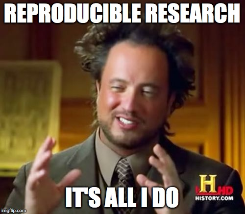

```{r, echo=FALSE, results = FALSE}
library(RJSONIO)
if(!file.exists("csl/abbreviations.json")){
download.file("https://ndownloader.figshare.com/files/5212423","wos_abbrev_table.csv")
  abbrev <- read.csv("wos_abbrev_table.csv",
                     sep = ";", header = TRUE,
                     stringsAsFactors = FALSE)
  abbrev$full <- gsub("\\", "\\\\",abbrev$full, fixed = TRUE)
  abbrev.list <- list('default' = list('container-title' = abbrev$abbrev.dots))
  names(abbrev.list$default$`container-title`) = abbrev$full
  write(toJSON(abbrev.list), "csl/abbreviations.json")
  file.remove("wos_abbrev_table.csv")
}
```


# Background

This will be the background section. I will probably have to make a citation or two here like this [@shannon2017;@li2017wellness]

# Methods

Here I will describe my amazing biomarker discovery project and how I quantitatively measured 45231 proteins simultaneously with mass spectrometry using one internal standard on a 10 min cycle time.

## Figures

I will embed a figure like this. I will be cross-referenced. See figure \@ref(fig:ancient-aliens)

```{r ancient-aliens, out.height="400px", out.width="300px", fig.align='center',fig.cap="This the is the ancient aliens guy.", echo = FALSE}

```

But I might also want to include a reference against the one ELISA I tested of my 45231 proteins. See figure \@ref(fig:example-code).

```{r example-code, fig.cap = "This is a reproducible figure", echo = FALSE}
set.seed(10)
x <- runif(100,0,100)
y <- 1.5*x + rnorm(100,0,0.9)*x + rnorm(100,0,5) + 50
plot(x,y,
main = "Reproducible Figure of My Mass Spec Protein Quant",
pch = 16,
col = "blue",
xlab = "ELISA (fmol/L)",
ylab = "Mass Spec (fmol/L)",
xlim = c(0,max(y)),
ylim = c(0,max(y)))
abline(lm(y~x), col = "blue", lty = 2)
abline(0, 1, col = "red")
```

## Inline Calculations

When you are reporting your amazing results you can have inline code like the median value of $x$ being reported as `r round(median(x),1)`.

## Tables

I have found `xtable()` a little easier to control than `kable()` but both work. See table \@ref(tab:example-table)

```{r,echo = FALSE, results = 'asis'}
library(xtable)
options(xtable.comment = FALSE)
a <- 1:5
b <- 2:6
c <- a*b
xtable(data.frame(a,b,c),
       caption = "xtable does a nice job",
       label = "tab:example-table")
```

## Math

Math works pretty magically using \LaTeX \space syntax. For example, $\sin^2x + \cos^2x = 1$. And:

$$
\exp(i\pi) = -1
$$

Equations can be cross-referenced just like tables and figures.

# Discussion

Clearly this method is awesome and I should get more funding from CIHR or NIH. Time to self--cite to improve my h-index [@holmes2005preanalytical] and maybe cite multiple papers together to show how the .csl file takes care for appropriate reference formatting. [@shannon2017;@li2017wellness;@holmes2005preanalytical]

# Conclusion

I hope this makes writing a reproducible paper easier for you. 

# References